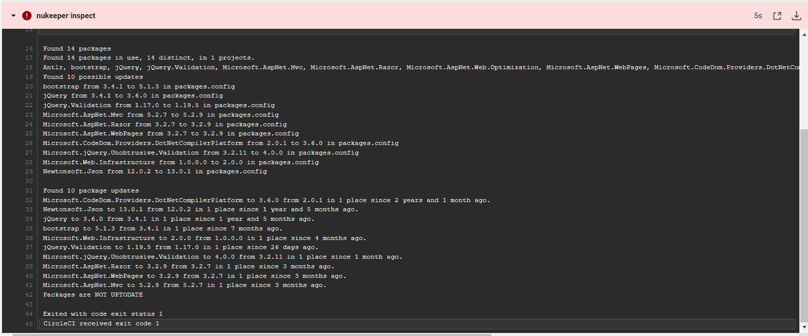

# OutdatedNuget-Framework
Pipeline for Testing Outdated Nuget Package in .Net  Framework 4.8 using [Nukeeper](https://github.com/NuKeeperDotNet/NuKeeper)

# Summary:

    1. I usednukeeper inspects the .csproj or .sln file in the current direcory (or any specified project or solution directory) and write the output to a file.
    2. Read the content of the logfile.
    3. checking if the logfile specify any possible package(s) that needs update, then returned an error if there is possible update, and no error if no update.

